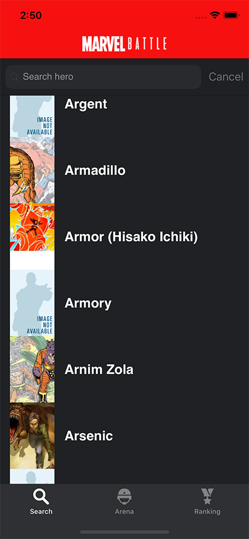
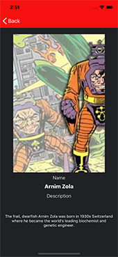
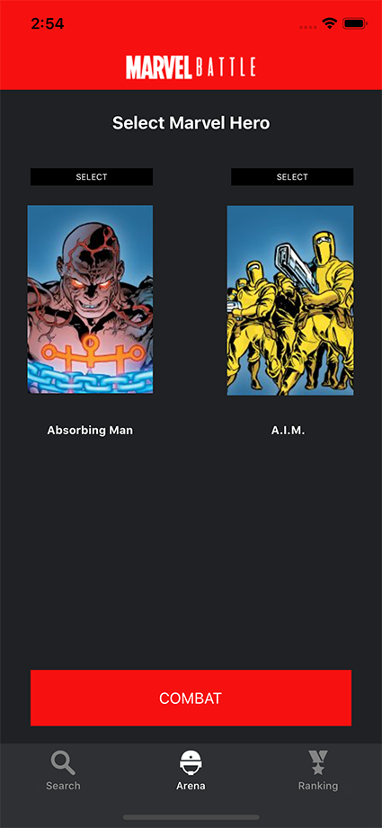
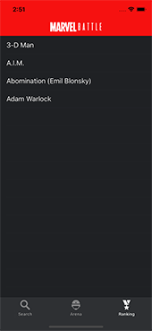

# Marvel Battle 

It is a practice with the API that Marvel provides for all those of us who are fanboy of Marvel. It was taken from the following URL https://developer.marvel.com. This app shows the marvel characters as well as a brief description, It presents a combat section where the characters can measure their strength based on the appearances in comics

## Image Captures

## Build 

Xcode 4.2 or later
iOS 12 or later
OS X 10.14.6
 

## Architecture Development and Decision Process

Understand the features of the supplied API and its content

Make a scalable data model for your development including abstraction layers for the network layer

Make a simple mockup to understand the needs of the practice and the flow of information in the app

I chose to use storyboard and code for some parameters that the storyboard did not allow

In the API data load, paging data is shown as it is scrolled its is more fast for the user ,but  with the option of making a complete initial load of all the data at the end of the project if the development time allows it.

Coredata is used for data persistence and its content is verified with the “DBBrowser for SQITElite” utility

In the development of functions and code, it is a matter of working under the S.O.L.I.D. principle, and generating a structure that is clear and divided for better updating and understanding, as well as naming functions that are explicit enough to avoid comments from unnecessary code and error control for functions 

An icon for the app is created in Illustrator and included through the “icon Set Creator” utility also a selection of icons according to the project

Finally a dark background is given and the characteristic marvel red color is used for the visual image of the app

For the entire process, commits were made using the “Sourcetree” utility available for OS X

## Deployment

Swift 5 
Xcode 11.2.1
OS X 10.14.6
Iiphone X and iphone SE Compatible

## Run in Simulator Xcode

In Xcode Select Signing & Capabilities in Target of App
Adjust Team
Change Bundle Identifier

## Cocoapods

- CryptoSwift 
Usada para la desencriptacion de la API 

## Frameworks
- Coredata
Used for data persistence on mobile
- UIkit
Provides the required infrastructure for  iOS

## Attribution

Data provided by Marvel. © 2014 Marvel
